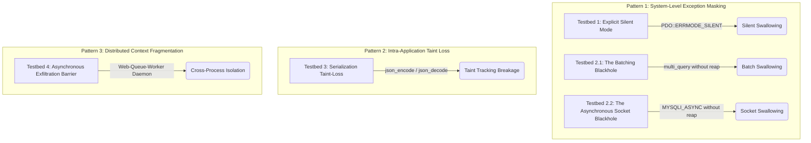

# 🛡️ Exception-Free Benchmark

An advanced evaluation suite comprising **5 distinct testbeds** designed to stress-test the detection capabilities of automated security tools (SAST, DAST, IAST, and Fuzzers) against "silent" and complex SQL Injection (SQLi) patterns. 

Traditional vulnerability scanners rely on visible oracle indicators (such as database error logs, HTTP 500 status codes, or unhandled exceptions) to confirm a vulnerability. The **Exception-Free Benchmark** targets the blind spots of these scanners by implementing realistic application architectures where SQL Injectability exists but is masked, swallowed, or fragmented.

---

## 📐 System Architecture & Patterns

The benchmark covers 3 primary evasion patterns distributed across 5 testbeds:



---

## 📂 Codebase Directory Structure

```text
silent-sqli-app/
├── Dockerfile                         # PHP-FPM 8.1 target environment image
├── docker-compose.yml                 # Orchestration for Nginx (8888), PHP-FPM (9000), & MySQL (3306)
├── nginx.conf                         # Reverse proxy configuration
├── README.md                          # Project Documentation (English)
├── db/
│   └── install_schema.sql             # DB Schema including testing honey/sensor tables
└── src/
    ├── index.php                      # Main Router & Interactive Dashboard UI
    ├── security/
    │   └── AppFilters.php             # Security sanitization filters
    └── api/                           # The Testbed Endpoints (Source & Sink Pairs)
        ├── aggregate_stats.php        # Testbed 1: Sink (Explicit Silent Mode)
        ├── track.php                  # Testbed 1: Source (Tracking API)
        ├── billing.php                # Testbed 2.1: Sink (Billing API with batch queries)
        ├── register.php               # Testbed 2.1: Source (Registration API)
        ├── fast_log.php               # Testbed 2.2: Combined (Async Socket Blackhole)
        ├── save_theme.php             # Testbed 3: Source (JSON Serializer)
        ├── index.php                  # Testbed 3: Sink (JSON Deserializer & SQLi)
        ├── request_report.php         # Testbed 4: Source (Job Queue Producer)
        ├── financial_worker.php       # Testbed 4: Sink (Background CLI Worker)
        └── check_status.php           # Testbed 4: Status Polling Endpoint
```

---

## 🧪 Detailed Testbeds Breakdown

### 1. Testbed 1: The Explicit Silent Mode
*   **Source Endpoint:** [track.php](file:///D:/silent-sqli-app/src/api/track.php)
*   **Sink Endpoint:** [aggregate_stats.php](file:///D:/silent-sqli-app/src/api/aggregate_stats.php)
*   **Vulnerability Pattern:** Second-Order SQLi under silent error handling.
*   **Mechanism:** 
    1. The client registers traffic logs safely via prepared statements in [track.php](file:///D:/silent-sqli-app/src/api/track.php).
    2. A cron/aggregation process in [aggregate_stats.php](file:///D:/silent-sqli-app/src/api/aggregate_stats.php) extracts these logs and aggregates stats using dynamic query building.
    3. The connection is configured with `$pdo->setAttribute(PDO::ATTR_ERRMODE, PDO::ERRMODE_SILENT)`. If a payload breaks the SQL query syntax, the driver returns `false` silently. No Exception is thrown, and the script execution proceeds normally.

### 2. Testbed 2.1: The Batching Blackhole (multi_query)
*   **Source Endpoint:** [register.php](file:///D:/silent-sqli-app/src/api/register.php)
*   **Sink Endpoint:** [billing.php](file:///D:/silent-sqli-app/src/api/billing.php)
*   **Vulnerability Pattern:** Second-Order SQLi under batched statement execution.
*   **Mechanism:**
    1. Customer registration stores the name parameter in the database.
    2. During synchronization in [billing.php](file:///D:/silent-sqli-app/src/api/billing.php), multiple queries are executed together via `$db->multi_query($sql)`.
    3. In MySQLi, syntax or runtime errors occurring in downstream queries of a batch are only exposed when iterating results using `mysqli_next_result()`. Since the code doesn't iterate, errors caused by injected payloads are completely swallowed.

### 3. Testbed 2.2: The Asynchronous Socket Blackhole (MYSQLI_ASYNC)
*   **Endpoint:** [fast_log.php](file:///D:/silent-sqli-app/src/api/fast_log.php)
*   **Vulnerability Pattern:** First-Order SQLi under asynchronous execution.
*   **Mechanism:**
    1. The API performs fire-and-forget logging using the `MYSQLI_ASYNC` flag.
    2. The PHP process forwards the SQL payload over the TCP socket and returns HTTP 200 OK instantly.
    3. Because `mysqli_reap_async_query()` is never called, the database engine's error response remains unread in the socket buffer. Standard DAST/Fuzzers observe a fast HTTP 200 OK with no stack traces or database errors.

### 4. Testbed 3: The Serialization Taint-Loss
*   **Source Endpoint:** [save_theme.php](file:///D:/silent-sqli-app/src/api/save_theme.php)
*   **Sink Endpoint:** [index.php](file:///D:/silent-sqli-app/src/api/index.php)
*   **Vulnerability Pattern:** Second-Order SQLi with data serialization.
*   **Mechanism:**
    1. User configuration payload is serialized into a JSON string using `json_encode()` and stored in the database.
    2. Traditional SAST tools lose track of the tainted variable when it goes through serialization/deserialization.
    3. In [index.php](file:///D:/silent-sqli-app/src/api/index.php), the settings are retrieved, decoded using `json_decode()`, and used directly in a dynamic SQL statement, resulting in a successful SQL Injection.

### 5. Testbed 4: The Asynchronous Exfiltration Barrier
*   **Source Endpoint:** [request_report.php](file:///D:/silent-sqli-app/src/api/request_report.php)
*   **Sink Daemon:** [financial_worker.php](file:///D:/silent-sqli-app/src/api/financial_worker.php)
*   **Status Endpoint:** [check_status.php](file:///D:/silent-sqli-app/src/api/check_status.php)
*   **Vulnerability Pattern:** Asynchronous Second-Order SQLi.
*   **Mechanism:**
    1. The client requests a heavy financial report via [request_report.php](file:///D:/silent-sqli-app/src/api/request_report.php), which queues the job to `heavy_report_jobs` and returns a job ID.
    2. An isolated CLI Worker daemon ([financial_worker.php](file:///D:/silent-sqli-app/src/api/financial_worker.php)) running in the background processes the job, constructing a highly complex dynamic query using the input.
    3. Any database exception is captured inside the background CLI process. The web thread remains unaffected, causing traditional scanners to see only a clean processing state via [check_status.php](file:///D:/silent-sqli-app/src/api/check_status.php).

---

## 🚀 Getting Started

### 📋 Prerequisites

*   Docker and Docker Compose installed on your system.

### 🛠️ Spinning Up the Environment

1.  Clone the repository and navigate to the project directory:
    ```powershell
    cd silent-sqli-app
    ```
2.  Start the containers:
    ```powershell
    docker-compose up -d --build
    ```
3.  Access the interactive Dashboard at:
    `http://localhost:8888`

---

## 🎯 Benchmark Evaluation & Oracles

This benchmark is intended to run alongside vulnerability scanners to evaluate their detection rates. 

Because errors are masked or executed out-of-band, traditional oracles (Error-based, Time-based) are often insufficient. The benchmark includes built-in sensors (`__phuzz_sensor_insert`, `__phuzz_sensor_update`, `__phuzz_sensor_delete`) to verify if security testing tools can successfully mutate payloads and execute arbitrary database manipulations:

| Testbed | Suppression Vector | Detection Challenge | Solution Oracle |
| :--- | :--- | :--- | :--- |
| **Testbed 1** | `ERRMODE_SILENT` | No HTTP/DB Exceptions | State-based / AST Hooking |
| **Testbed 2.1** | Un-iterated batch queries | Subsequent errors swallowed | Side-channel DB sensors |
| **Testbed 2.2** | `MYSQLI_ASYNC` without reap | Errors locked in network socket | Query-level instrumentation |
| **Testbed 3** | JSON Serialization | Static taint-tracking breakage | AST Tracking & Deep-IAST |
| **Testbed 4** | Process Isolation (Worker) | Isolated execution thread | Daemon telemetry & Out-of-band monitoring |

